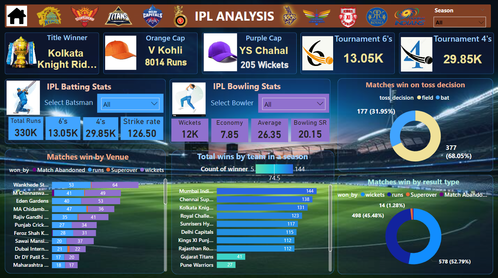

In this Project we will be discussig about the IPL data using Power BI
1. Data Collection - Kaggle dataset,
2. Data Transformation and data cleaning in Power Query editor in Power BI desktop,
3. DAX (Data analysis Expression) & KPI Dashboards in Power BI desktop and publish it.,
# Power_bi-IPL
see the full_dashboard here: 
[App Power BI link](https://app.powerbi.com/view?r=eyJrIjoiZjVhMGRhNjUtYjdlZS00ZWRlLWFmM2YtOWViNGVmMDc4N2NkIiwidCI6IjY5Y2NmZWQzLTdiMDctNDI5NS04MTBmLThkMzIwNzg1MTY5OSIsImMiOjEwfQ%3D%3D)

[IPL_screenshot]

